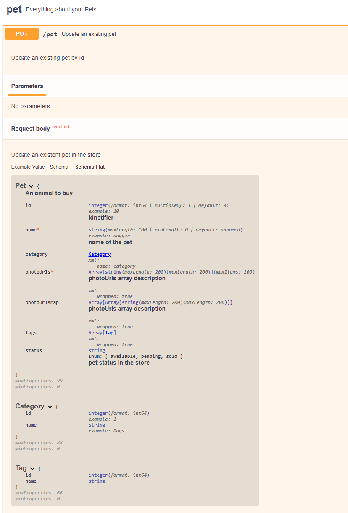

# swagger-ui-flat-model-plugin

 

Plugin for [swagger-ui](https://github.com/swagger-api/swagger-ui) to add an additional way to display the request/responses models inspired by swagger-ui-2.

[Plugin Demo](https://marc0l92.github.io/swagger-ui-flat-model-plugin/)



## How to use it

## From npm

- Install the dependency

```sh
npm install swagger-ui-flat-model-plugin
```

- Use it in the SwaggerUI object initialization

```ts
import { SwaggerUiFlatModelPlugin } from 'swagger-ui-flat-model-plugin';

SwaggerUI({
    url: './data/openapi.json',
    dom_id: '#swagger-ui',
    plugins: [SwaggerUiFlatModelPlugin],
});
```

### From source

- Download the files in the `dist` folder:

```
dist/swagger-ui-flat-model-plugin.css
dist/swagger-ui-flat-model-plugin.js
```

- Include them in your website:

```html
<link rel="stylesheet" href="./css/swagger-ui-flat-model-plugin.css" />
<script src="./js/swagger-ui-flat-model-plugin.js"></script>
```

- Initialize the swagger ui using this plugin

```js
SwaggerUIBundle({
    url: './data/openapi.json',
    dom_id: '#swagger-ui',
    plugins: [swaggerUiFlatModelPlugin],
});
```

See the [example in the test folder](https://github.com/marc0l92/swagger-ui-flat-model-plugin/blob/master/test/index.html) for more details.